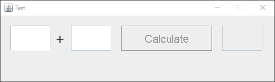

# MVC Design Pattern Test

> note: This example also adopts the Decorator Pattern.

## Project:
> A quick study for the MVC pattern, the project is a simple app that sums two number regardless of theeir type either if they're both of type `Integer` / `Double` or even `a mix of Double and Integer`.
## Preview:

# MVC:
| Model  | View  | Controller  |
| :------------ | :------------ | :------------ |
| CalculationModel  | MyFrame  | DataController  |

| Class  | Description  |
| :------------ | :------------ |
| CalculationModel  | Performs the logic to sum the numbers  |
| MyFrame  | Extends JFrame - a simple UI  |
| DataController  | is the connection between the UI and the logic  |
| Others  | MyPanel: extends JPanel - hosts all the UI components  |
|   | MyLabel, MyTextField: Custom built components  |

| InputChecker  |
| :------------ |
| sets the state of the UI components according to the user input  |
|  prevents the user from entering non-numeric values.  |