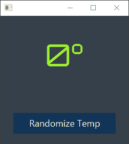

# Observer Pattern 👀️

> a simple JavaFx app that randomizes temperature.

## Preview




### Fire Event:

```java
public void setTemperature() {
        int oldTemperature = this.temperature;
        this.temperature = new Random().nextInt(47) ;
        this.propertyChangeSupport.firePropertyChange("temperature", oldTemperature, this.temperature);
    }
```

### Injecting the FXML Controller into SensorHub:

```java
private Controller controller;
    public void injectController (Controller controller){
        this.controller = controller;
    }
  
    @Override
    public void propertyChange(PropertyChangeEvent evt) {
        this.controller.setTemp(evt.getNewValue().toString());
    }
```

### Firing the event from the FXML Controller:

```java
public void setTemp (String temperature){
        this.myLabel.setText(temperature + "°");
    }

    @FXML
    public void randomize(ActionEvent actionEvent) {
        TemperatureSensor.getInstance().setTemperature();
    }

    @FXML private void initialize(){
        hub.injectController(this);
        TemperatureSensor.getInstance().addListener(hub);
    }
```

### Important note:

> the app uses google fonts in it's css stylesheet, it would be recommended that your device is connected to the internet while testing the code.
