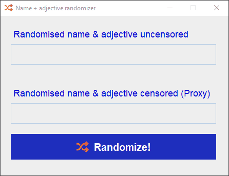
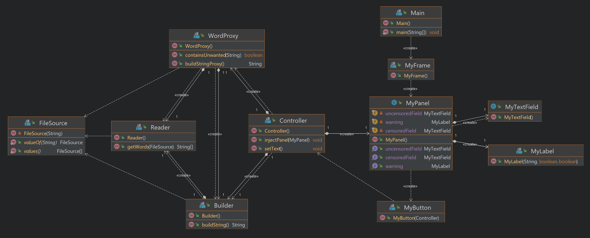

# Proxy Pattern

> ## the application is built with Java Swing

This simple application random-generates a sentence with a name and an adjective.

To generate the names and the adjectives I am using two dictionary files `adjectives.csv` and `names.csv`

The Proxy proccess uses the file `badWords.csv`to filter the output.

All the GUI components are customized this implicates that the application also implements `Decorator Pattern`

### Preview:

## Diagram
